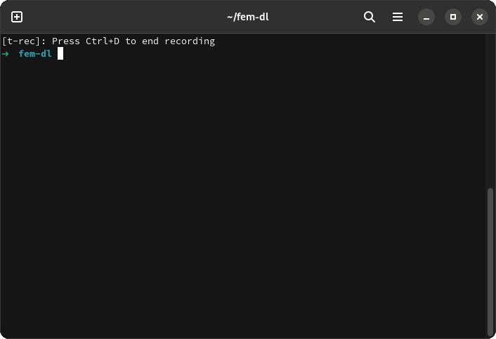

# Frontend Masters Downloader




### Features
- Download episodes sorted by their lesson/section
- Option to include subtitles/captions to the episodes
- Support multiple video quality
- Support multiple video formats (currently: mp4 and mkv)


### Requirements
- Nodejs v16 or newer installed
- Git Installed

### Usage
1. Clone the repo 
```sh
$ git clone https://github.com/abdulrahman1s/fem-dl.git
$ cd fem-dl
```

2. Rename [`cookies.example.json`](./cookies.example.json) to `cookies.json`

3. Copy the saved cookies at **frontendmasters.com** to `cookies.json` ([Guide](https://developer.chrome.com/docs/devtools/storage/cookies/))

4. Run!
```sh
$ npm install && npm start
```


### Disclaimer
I am not responsible for any use of this program, please read [FrontendMasters terms of service](https://static.frontendmasters.com/assets/legal/MasterServicesAgreement.pdf) before using this.